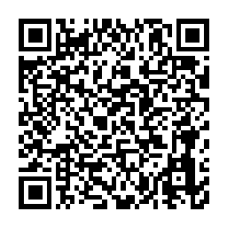

# QR Code Generator

Generate PNG QR Code image from qr code data with Zatca specification using [zatca-sdk-go](https://github.com/Haraj-backend/zatca-sdk-go)

## Usage 
```golang
// install packages
go mod tidy

// run script
go run main.go
```

## Generated QR Code Example
